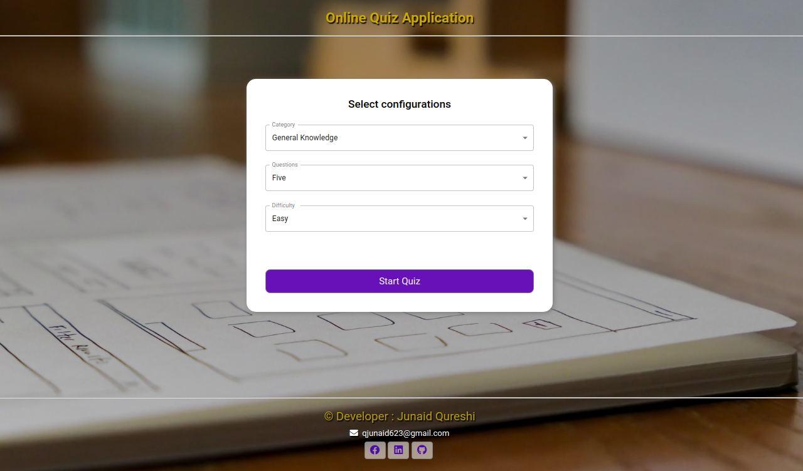
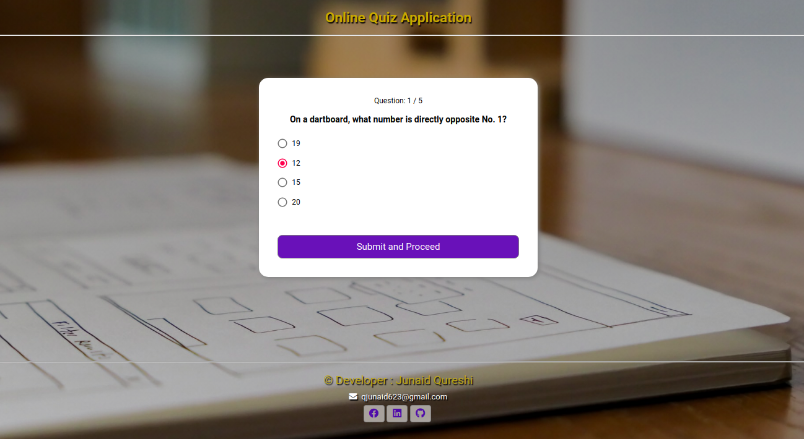

# :clipboard: Online Quiz Application 

### *An Online Quiz Application, built using React js and Typescript.*
http://online-quiz-app.surge.sh/

## Images 

## Features

- Select Questions 
- Select Difficulty level
- Select Category
- Give Quiz
- See Results
- Try Again
- Mobile Responsive
- Form Validation
- Accessibility Optimized

## Run Locally 

- Run this command `git clone https://github.com/developer-junaid/Quiz-Application.git`
- You are now in the dev environment and you can play around 

## Tech Stack

- HTML5
- CSS3
- Javascript ES6
- React js
- Typescript (beta)
- API
- Surge
- Github Actions
