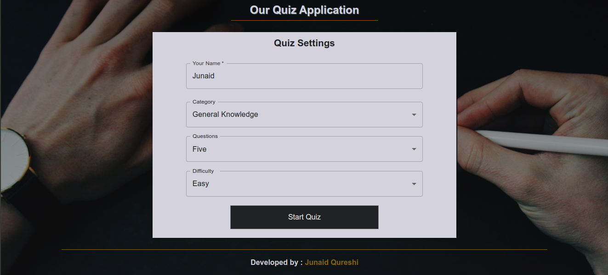
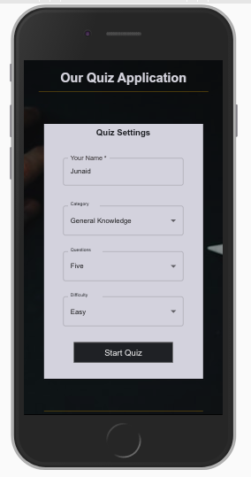
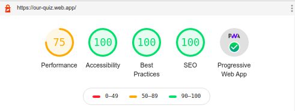

# Our Quiz - Web Application

### On PC

### On Mobile

### Lighthouse Performance Testing Result

### link : http://our-quiz.web.app/

### Youtube Video (Demo) : https://youtu.be/RnTska40jiU

### _A Quiz Progressive Web Application built using ReactJs, Typescript. You can install it on your devices (Mobile, Desktop) and can use it offline_

## Functionalities

- Select Quiz Settings
- Perform Quiz and Get Results

## PWA Functionalities

- You can install it on PC, Mobile
- Offline availablity

## Features

- Secure
- Accessibility Optimized
- Fast
- Less in size
- SEO Optimized
- Mobile Responsive

## Run Locally

- Run this command `git clone https://github.com/developer-junaid/Quiz-Application.git`
- You are now in the dev environment and you can play around

## Tech Stack

- HTML5
- CSS3
- Sass
- Javascript +ES6
- React Js
- Typescript
- Service Workers
- Firebase hosting
